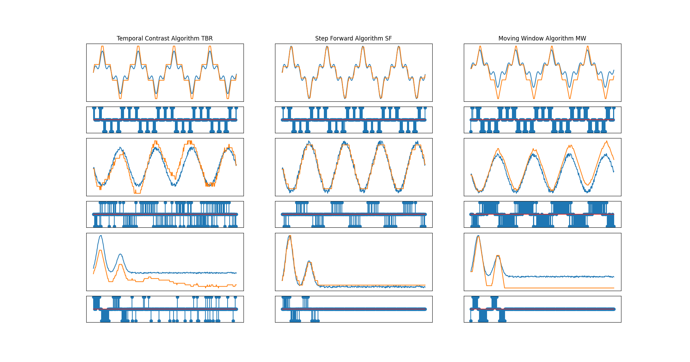

# SpikeCoding

This package features MATLAB, Python and ROS implementations of spike encoding and decoding algorithms. So far, the following algorithms are available:
- Population coding:
	- [Matlab][Python][ROS] Gaussian Receptor Fields
	- [Matlab][Python] Bohté et al. (2002) GRF
- Temporal coding:
	- [Matlab][Python][ROS] Temporal contrast
	- [Matlab][Python][ROS] Step-forward
	- [Matlab][Python][ROS] Moving window
- Rate coding: 
	- [Matlab][Python] Hough spike
	- [Matlab][Python] Threshold Hough
	- [Matlab][Python] Ben's spike

Supporting paper: https://arxiv.org/abs/2103.02751

TODOs: 
- Finish integration of rate coding to ROS node
- Add Population schemes to ROS node
- Implement the following schemes: non-linear GRF, ROC, Poisson, LPC.
- Upload review table & add references on README
- Generate tests for MNIST dataset
- Generate tests for IMU data from the Obstacle Detection & Avoidance Dataset
- Setup framework for parameters optimisation (DEAP, PyEvolve, PyBrain)
- Include to PySNN (?)

---

*This work is part of the Comp4Drones project and has received funding from the ECSEL Joint Undertaking (JU) under grant agreement No. 826610. The JU receives support from the European Union's Horizon 2020 research and innovation program and Spain, Austria, Belgium, Czech Republic, France, Italy, Latvia, Netherlands.*

---

## 1. MATLAB Implementation

The MATLAB codes are available in *SpikeCodingMatlab*. Within this folder, simply execute the `SpikeCoding.m` file to have an overview of the results (encoding/decoding) of the implemented schemes tested on 3 different functions.

## 2. Python Impmementation

The Python scripts are available in *SpikeCodingPython*. Within this folder, simply execute the `main.py` file to have an overview of the results (encoding/decoding) of the implemented schemes tested on  3 different functions. 

Here you can find the results: 

## 3. ROS Package

The ROS folder contains the following packages: 
- *spyke_coding*: creates a ROS node to generate spikes based on input data and the selected coding scheme.
- *spyke_coding_schemes*: includes all the encoding and decoding functions used in the *spyke_coding* package.
- *spyke_msgs*: defines the custom spiking messages to be published.

### Installing

Install ROS Noetic (for Ubuntu Focal 20.04 LTS) using the following tutorial:  http://wiki.ros.org/noetic/Installation/Ubuntu 

Install *catkin* python tools: 

	sudo apt-get install python3-catkin-tools 
	
Install additionnal dependencies:

	sudo apt install python3-catkin-lint python3-pip
	pip3 install osrf-pycommon==0.1.9
	pip3 install empy

Then create your workspace:

	cd~ 
	mkdir -p catkin_ws/src

Clone this repository, and copy the ROS packages to your `~/catkin_ws/src/` folder. Then compile your project: 

	cd /catkin_ws/
	catkin_make
	source ~/catkin_ws/devel/setup.bash

### Testing

The *spyke_coding* package includes a set of launch files for each type of encoding. In its present form, the package defines a fake signal with a given sampling period `dt` and a signal duration `T_max` (in seconds). Both temporal and rate coding schemes use a buffer of size `1/dt`. 

Once the ROS node is launched, it automatically stops after `T_max` seconds, or if the user press `ctrl+c`. The output data is stored here: `~/.ros/encoding.bag`

Example on the temporal-contrast encoding: 

	cd /catkin_ws/
	source ~/catkin_ws/devel/setup.bash
	roslaunch spyke_coding encode_temporal_contrast.launch

After completion, you can plot the results using the dedicated Python script:

	cd <path_to_this_repository>/SpikeCodingPython/
	python process_rosbags.py ~/.ros/encoding.bag

Here is an example result: 

List of the available launch files: 
- `encode_temporal_contrast.launch`
- `encode_step_forward.launch`
- `encode_moving_window.launch`
- `encode_hough.launch`
- `encode_threshold_hough.launch`
- `encode_bsa.launch`
- `encode_gaussian_fields.launch`
